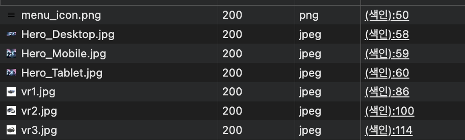
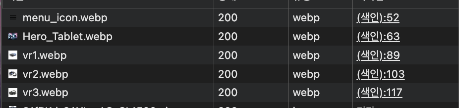
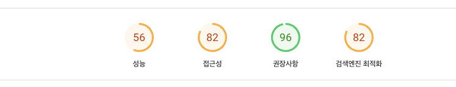
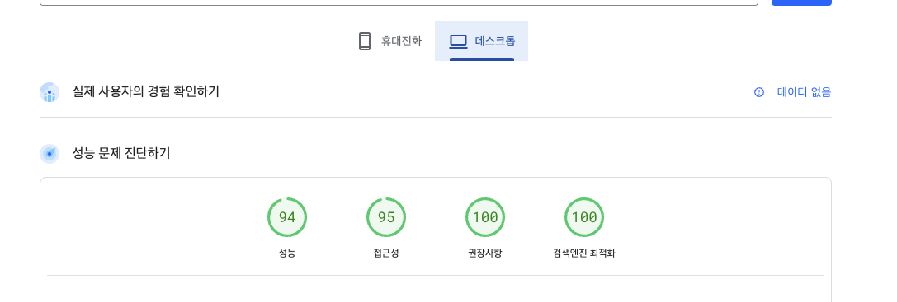
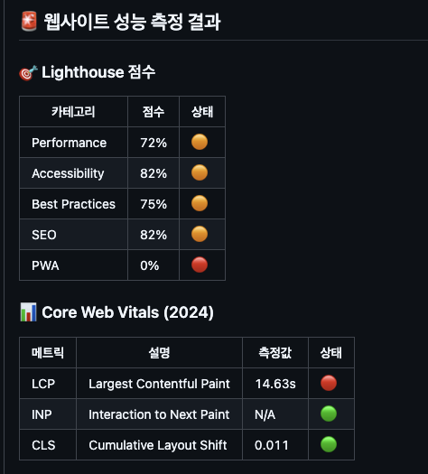
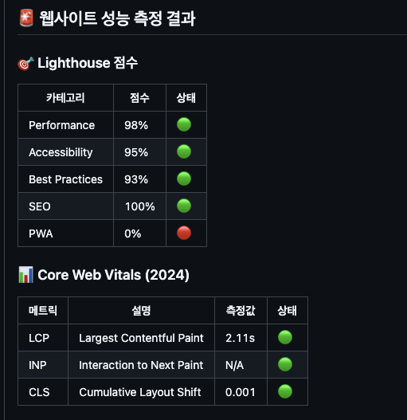

# 바닐라 JS 프로젝트 성능 개선
- url: https://d3gs5nas7hlj2g.cloudfront.net

## 배포 다이어그램

## 성능 개선 보고서

### 1. 이미지 최적화

- 정적 이미지 JPG 확장자를 WdbP로 변환 및 용량 압축 
  - 정적 이미지의 JPG 확장자를 WebP로 변환하여 용량을 압축합니다. 
  - 이미지 파일 크기를 줄임으로써 데이터 전송량을 줄이고 페이지 로드 속도를 개선합니다.
       
| File Name         | JPG Size (kB) | WebP Size (kB) | Size Reduction (kB) | Percentage Reduction (%) |
|--------------------|---------------|----------------|----------------------|--------------------------|
| Hero_Desktop       | 1126          | 128            | 998                  | 88.63%                   |
| Hero_Tablet        | 788           | 61             | 727                  | 92.26%                   |
| Hero_Mobile        | 415           | 31.1           | 383.9                | 92.51%                   |
| vr1                | 54            | 6.6            | 47.4                 | 87.78%                   |
| vr2                | 90.9          | 12.7           | 78.2                 | 86.02%                   |
| vr3                | 76.7          | 8.4            | 68.3                 | 89.14%                   |

**LCP : 14.63s > 3.03s**

**변경전**

| 메트릭 | 설명 | 측정값 | 상태 |
|--------|------|--------|------|
| LCP | Largest Contentful Paint | 14.63s | 🔴 |

**변경후**

| 메트릭 | 설명 | 측정값   | 상태 |
|--------|------|-------|----|
| LCP | Largest Contentful Paint | 3.68s | 🟠 |

- picture 태그를 사용한 불필요한 리소스 요청 방지 
  - media query를 이용해 뷰포트에 맞는 리소스를 요청하여 불필요한 리소스 요청을 방지합니다.

    | Before                                             | After                                               |
    |----------------------------------------------------|-------------------------------------------------------------|
    |  |  |

### 2. CLS (Cumulative Layout Shift) 최적화

- 사용 이미지 width, height 속성 추가 
  - width, height 속성을 추가하여 로기 렌더링시 레이아웃을 고정합니다.

- display hidden 요소 수정 
  - 불필요한 display hidden 요소를 min-height 속성을 통해 레이아웃을 고정합니다.

- lazy loading 적용
  - 뷰 포트에 보이는 이미지들만 요청하고 뷰 포트에 보이지 않는 이미지는 요청하지 않습니다.
  - 이미지가 로드되며 발생하는 레이아웃 이동을 줄입니다.
  - 초기 뷰 포트에만 보이는 이미지를 로드하기에 초기 페이지 로드 속도를 줄입니다.

**변경전**

| 메트릭 | 설명 | 측정값   | 상태 |
|--------|------|-------|------|
| CLS | Cumulative Layout Shift | 0.011 | 🟢 |

**변경후**

| 메트릭 | 설명 | 측정값 | 상태 |
|--------|------|--------|------|
| CLS | Cumulative Layout Shift | 0.001 | 🟢 |

### 3. 렌더링 차단 리소스 제거 / FCP, LCP 최적화

- script tag defer 적용
  - script tag defer는 HTML 파싱을 멈추지 않고 병렬적으로 다운로드를 진행합니다.
  - DOMContentLoaded 이벤트( DOM 파싱 ) 후 스크립트를 실행 합니다.
  - DOM(랜더링)을 차단하지 않게 됨으로 FCP, LCP를 최적화 합니다.

- 정적 폰트로 스타일 적용
  - 스크립트를 통해 폰트를 다운로드하는 것이 아닌 정적 폰트 파일로 사용합니다.

**변경전**

| 메트릭 | 설명 | 측정값 | 상태 |
|--------|------|--------|------|
| LCP | Largest Contentful Paint | 3.68s | 🟠 |

**변경후**

| 메트릭 | 설명 | 측정값   | 상태 |
|--------|------|-------|----|
| LCP | Largest Contentful Paint | 2.11s | 🟢 |

### 4. 웹 접근성 최적화

- 이미지 alt 속성을 추가
  - 이미지 로드가 실패하여도 대체텍스트가 노출이 되게 하여 접근성을 높입니다. 

### 5. 검색 엔진 최적화

- description meta tag 추가
  - description meta tag 를 추가하여 검색 결과 하단에 설명을 추가합니다. 

## 성능 측정 최종 결과

### Page Speed

| Before                                                     | After                                               |
|------------------------------------------------------------|------------------------------------------------------------|
|  |  |

### Light House

| Before                                                       | After                                               |
|--------------------------------------------------------------|-------------------------------------------------------------|
|  |  |
